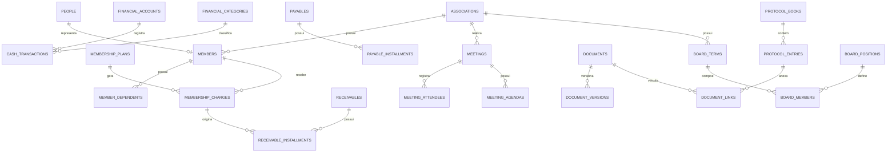

# Sistema de Gestão de Associações Comunitárias — especificação de domínio

> **Status:** documento de referência, colado pelo usuário em 2026-09-01.
> Ainda **não implementado**. Este arquivo preserva a especificação como
> recebida, para servir de base quando o módulo de domínio for de fato
> desenhado e implementado no app.
>
> **Atenção — divergências conhecidas com o projeto atual (ver
> [`CLAUDE.md`](../CLAUDE.md) e [`.claude/rules/database.md`](../.claude/rules/database.md)):**
> - O SQL da seção 5 é escrito para **PostgreSQL** (tipos `UUID`,
>   `gen_random_uuid()`, `ENUM`, `INET`, `JSONB`). O projeto usa **SQLite**
>   via `tauri-plugin-sql`, que não tem esses tipos nativamente — a adaptação
>   vai exigir `TEXT` para UUID (gerado na aplicação ou via `hex(randomblob(16))`),
>   `TEXT` com `CHECK` no lugar de `ENUM`, e sem `INET`/`JSONB` nativos.
>   Migrations no projeto também são **append-only** e começam em
>   `version: 1`, uma por mudança de schema (nunca editar uma já existente).
> - A mensagem original do usuário foi cortada pelo limite de caracteres do
>   cliente; a seção 10 (API sugerida) é o último trecho recebido —
>   pode haver seções posteriores (ex.: roadmap, glossário) que não
>   chegaram a este arquivo. Confirmar com o usuário se falta conteúdo.

## 1. Objetivo do sistema

O sistema deverá centralizar a administração da associação, permitindo
controlar o cadastro dos sócios, as mensalidades, as receitas e despesas, as
contas financeiras, os documentos institucionais, os livros de protocolos e
as atividades de governança. A proposta abaixo separa o **cadastro
principal**, o **financeiro**, a **secretária/documentos**, a **governança**
e os **controles administrativos**, de modo que o sistema possa começar com
um MVP e crescer sem precisar refazer o banco de dados.

Vamos usar o banco de dados SQLite local e permitir o cadastro de várias
associações no mesmo computador.

> **Princípio central:** o sócio é a pessoa titular do vínculo com a
> associação; mensalidades, documentos, participações, atendimentos e
> movimentações financeiras devem referenciá-lo sem duplicar seus dados
> pessoais.

## 2. Principais módulos e funções

### 2.1 Cadastro da associação

O sistema deve permitir cadastrar uma ou mais associações, com razão social,
nome fantasia, CNPJ, endereço, contatos, estatuto, data de fundação, situação
cadastral e dados bancários. Essa camada é importante para que o produto
possa atender filiais, núcleos ou mais de uma associação no futuro.

| Módulo | Funções principais | Prioridade |
| :---- | :---- | ----: |
| Cadastro institucional | Dados da associação, CNPJ, endereço, contatos, estatuto, mandato atual e configurações | MVP |
| Sócios | Inclusão, edição, pesquisa, matrícula, situação, histórico, dependentes, documentos e contatos | MVP |
| Categorias e planos | Categoria de sócio, valor da mensalidade, periodicidade, descontos e isenções | MVP |
| Mensalidades | Geração de cobranças, vencimentos, pagamentos, recibos, atrasos, renegociação e baixa | MVP |
| Fluxo de caixa | Lançamentos de receitas e despesas, categorias, centros de custo, conciliação e relatórios | MVP |
| Contas financeiras | Caixa, bancos, carteiras, contas digitais, saldos e transferências | MVP |
| Contas a pagar | Despesas previstas, vencimentos, aprovações, pagamentos parciais e comprovantes | MVP |
| Contas a receber | Mensalidades, doações, convênios, aluguéis, eventos e outras receitas | MVP |
| Protocolos | Numeração de ofícios, portarias, requerimentos, declarações e documentos recebidos/enviados | MVP |
| Documentos e registros | Upload, classificação, versionamento, metadados, validade, assinatura e histórico | MVP |
| Usuários e permissões | Perfis, permissões por módulo, acesso por associação e trilha de auditoria | MVP |
| Assembleia e reuniões | Convocações, pautas, participantes, ata, decisões e anexos | Fase 2 |
| Diretoria e cargos | Mandatos, cargos, titulares, suplentes, início, término e impedimentos | Fase 2 |
| Projetos e convênios | Projetos sociais, metas, financiadores, repasses, despesas e prestação de contas | Fase 2 |
| Atendimento comunitário | Solicitações, famílias, encaminhamentos, benefícios e histórico de atendimento | Fase 2 |
| Patrimônio | Bens, localização, responsável, manutenção, movimentação e baixa | Fase 2 |
| Eventos e atividades | Calendário, inscrições, presença, custos, receitas e avaliação | Fase 2 |
| Comunicação | Comunicados, modelos, envio segmentado, notificações e confirmação de leitura | Fase 3 |
| Indicadores | Painel de sócios, inadimplência, caixa, receitas, despesas, projetos e documentos | Fase 3 |

### 2.2 Gestão de sócios

O módulo deverá possuir uma ficha completa do associado, com histórico de
alterações e situação atual. A situação não deve ser apagada quando o sócio
sair da associação; deve ser encerrada com data, motivo e observação,
preservando o histórico.

As situações recomendadas são `ATIVO`, `INATIVO`, `SUSPENSO`, `DESLIGADO`,
`FALECIDO` e `PENDENTE`. O sistema deve impedir duas matrículas iguais dentro
da mesma associação e permitir localizar o associado por nome, CPF,
matrícula, telefone ou e-mail.

Também é recomendável separar **pessoa**, **vínculo associativo** e
**dependente**. Assim, uma mesma pessoa não precisa ser cadastrada novamente
caso participe de mais de uma associação, e um dependente pode ser associado
a mais de um responsável quando isso fizer sentido para a regra da entidade.

### 2.3 Mensalidades e cobrança

O sistema deverá gerar mensalidades individualmente ou em lote, de acordo com
a categoria do sócio e a competência. Cada cobrança deve possuir valor
original, descontos, juros, multa, valor final, vencimento, situação e data
de pagamento. A competência deve ser armazenada como mês de referência, por
exemplo `2026-09-01`, e não apenas como texto.

A baixa financeira deve gerar um lançamento de receita no fluxo de caixa,
salvo quando a mensalidade for marcada como quitada por uma integração
externa ainda não conciliada. Para evitar duplicidade, uma mesma cobrança não
pode gerar duas baixas financeiras sem estorno explícito.

### 2.4 Fluxo de caixa e contas financeiras

O fluxo de caixa deve registrar cada entrada e saída efetivamente realizada,
com conta financeira, data de competência, data de movimento, valor,
categoria, centro de custo, origem, usuário responsável e comprovante. O
sistema deve diferenciar **previsto** de **realizado** e não deve permitir
que uma conta a pagar ou a receber altere o saldo realizado antes da baixa.

As transferências entre contas da própria associação devem gerar dois
movimentos vinculados por um mesmo identificador: uma saída na conta de
origem e uma entrada na conta de destino. Elas não devem ser contadas como
receita ou despesa operacional nos relatórios.

### 2.5 Contas a pagar e contas a receber

As contas a pagar devem permitir fornecedor, descrição, documento, parcela,
vencimento, valor, aprovação, pagamento parcial, juros, desconto, comprovante
e vínculo com projeto ou centro de custo. As contas a receber devem permitir
pagador, origem da receita, vencimento, recebimento parcial, desconto, juros,
comprovante e vínculo com associado, doador, convênio ou evento.

É recomendável manter contas a pagar e contas a receber em tabelas próprias,
ligadas aos lançamentos financeiros por uma relação de origem. Isso permite
controlar compromissos futuros sem misturá-los com o caixa efetivamente
movimentado.

### 2.6 Livros de protocolos

O livro de protocolo deve registrar documentos recebidos e expedidos. Cada
registro deve ter número, ano, tipo, direção, data, remetente, destinatário,
assunto, responsável, prazo, situação, resposta relacionada e arquivo
digital.

A numeração deve ser controlada por associação, livro, ano e tipo, usando uma
tabela de sequência. O número não deve ser calculado apenas pelo total de
registros, pois exclusões, concorrência e lançamentos simultâneos podem
provocar duplicidade. Registros protocolados devem ser cancelados, e não
apagados.

### 2.7 Gestão de documentos e registros

O módulo de documentos deve armazenar os metadados no banco e o arquivo em
armazenamento de objetos ou servidor de arquivos. O banco deve guardar apenas
a chave do arquivo, nome original, extensão, tamanho, hash, tipo MIME e
versão. Isso evita que o banco fique excessivamente grande e permite
auditoria do conteúdo.

Documentos podem ser vinculados a sócios, protocolos, atas, reuniões, contas,
projetos, patrimônio ou à associação. Como diferentes entidades podem receber
anexos, recomenda-se uma tabela de relação genérica `document_links`, com
validação no serviço da aplicação para garantir que o tipo e o identificador
informado existam.

## 3. Modelo conceitual de dados

O modelo é dividido nos seguintes grupos:

| Grupo | Entidades centrais | Relações relevantes |
| :---- | :---- | :---- |
| Institucional | `associations`, `addresses`, `contacts` | Uma associação possui endereço e contatos institucionais |
| Pessoas | `people`, `members`, `member_dependents`, `member_contacts` | Uma pessoa pode ter vínculo associativo e dependentes |
| Financeiro | `membership_plans`, `membership_charges`, `financial_accounts`, `financial_categories`, `cash_transactions` | Cobrança, pagamento e movimento de caixa ficam relacionados |
| Obrigações financeiras | `payables`, `payable_installments`, `receivables`, `receivable_installments` | Contas previstas são baixadas em movimentos realizados |
| Secretaria | `protocol_books`, `protocol_entries`, `documents`, `document_versions`, `document_links` | Protocolo e registro institucional podem possuir documentos |
| Governança | `meetings`, `meeting_attendees`, `meeting_agendas`, `board_positions`, `board_terms`, `board_members` | Reuniões, atas e mandatos são rastreáveis |
| Projetos | `projects`, `project_funders`, `project_budgets`, `project_expenses` | Projetos recebem recursos e despesas vinculadas |
| Administração | `users`, `roles`, `permissions`, `audit_logs`, `system_settings` | Usuários possuem papéis e todas as alterações relevantes são auditadas |

### 3.1 Diagrama simplificado



## 4. Tabelas do banco de dados

A seguir está o dicionário recomendado. Todos os identificadores primários
devem ser `UUID`, salvo tabelas de configuração ou códigos controlados. As
colunas `created_at`, `updated_at`, `created_by` e `updated_by` podem ser
adicionadas a todas as tabelas transacionais quando houver necessidade de
auditoria detalhada.

> No projeto (SQLite), `UUID` deste dicionário deve virar `TEXT` (gerado na
> aplicação ou via `hex(randomblob(16))`), conforme observação no topo deste
> arquivo.

### 4.1 Tabelas institucionais e de pessoas

| Tabela | Finalidade | Campos principais |
| :---- | :---- | :---- |
| `associations` | Cadastro da entidade | `id`, `legal_name`, `trade_name`, `cnpj`, `foundation_date`, `status`, `email`, `phone`, `website`, `settings` |
| `addresses` | Endereços reutilizáveis | `id`, `association_id`, `person_id`, `address_type`, `street`, `number`, `complement`, `district`, `city`, `state`, `country`, `zip_code`, `is_primary` |
| `people` | Cadastro de pessoas físicas | `id`, `full_name`, `birth_date`, `nationality`, `marital_status`, `cpf`, `rg`, `profession`, `mother_name`, `father_name`, `notes` |
| `person_contacts` | Telefones e e-mails | `id`, `person_id`, `contact_type`, `contact_value`, `is_primary`, `is_verified` |
| `members` | Vínculo da pessoa com a associação | `id`, `association_id`, `person_id`, `registration_number`, `association_date`, `status`, `exit_date`, `exit_reason`, `membership_plan_id`, `observations` |
| `member_dependents` | Filhos e demais dependentes | `id`, `member_id`, `dependent_person_id`, `relationship`, `is_financial_dependent`, `observations` |
| `member_representatives` | Responsáveis ou representantes | `id`, `member_id`, `person_id`, `relationship`, `start_date`, `end_date` |
| `member_status_history` | Histórico da situação do sócio | `id`, `member_id`, `old_status`, `new_status`, `effective_date`, `reason`, `changed_by` |
| `member_documents` | Documentos cadastrais específicos | `id`, `member_id`, `document_type`, `document_number`, `issue_date`, `expiration_date`, `document_id` |

A ficha solicitada pelo usuário fica distribuída entre `people`, `addresses`,
`person_contacts`, `members` e `member_dependents`. A separação evita uma
tabela excessivamente larga e permite que telefones, endereços, dependentes e
documentos tenham histórico próprio.

| Campo solicitado | Tabela recomendada | Coluna |
| :---- | :---- | :---- |
| Nome | `people` | `full_name` |
| Data de nascimento | `people` | `birth_date` |
| Matrícula | `members` | `registration_number` |
| Data de associação | `members` | `association_date` |
| Endereço, estado, cidade e CEP | `addresses` | `street`, `state`, `city`, `zip_code` |
| Estado civil | `people` | `marital_status` |
| Nacionalidade | `people` | `nationality` |
| CPF e RG | `people` | `cpf`, `rg` |
| Profissão | `people` | `profession` |
| Filiação 1 e 2 | `people` | `mother_name`, `father_name` |
| Esposo(a) | `member_representatives` ou relação entre pessoas | `person_id`, `relationship` |
| Filhos | `member_dependents` | `dependent_person_id`, `relationship = FILHO` |

### 4.2 Tabelas de mensalidades

| Tabela | Finalidade | Campos principais |
| :---- | :---- | :---- |
| `membership_plans` | Categorias ou planos de contribuição | `id`, `association_id`, `name`, `description`, `amount`, `frequency`, `due_day`, `is_active` |
| `member_plan_history` | Histórico de categoria/valor do sócio | `id`, `member_id`, `membership_plan_id`, `start_date`, `end_date`, `custom_amount`, `reason` |
| `membership_charges` | Cobrança mensal do sócio | `id`, `association_id`, `member_id`, `membership_plan_id`, `competence_month`, `due_date`, `principal_amount`, `discount_amount`, `interest_amount`, `penalty_amount`, `total_amount`, `status`, `paid_at` |
| `charge_adjustments` | Descontos, juros, multas e ajustes | `id`, `charge_id`, `adjustment_type`, `description`, `amount`, `created_by` |
| `charge_payments` | Pagamentos e baixas da cobrança | `id`, `charge_id`, `cash_transaction_id`, `paid_amount`, `paid_at`, `payment_method`, `receipt_number` |
| `member_exemptions` | Isenções temporárias | `id`, `member_id`, `start_month`, `end_month`, `reason`, `approved_by`, `document_id` |

As cobranças devem possuir restrição única por `association_id`,
`member_id`, `competence_month`, exceto quando a regra permitir mais de uma
cobrança extraordinária na mesma competência. Nesse caso, deve existir uma
coluna `charge_type`, com valores como `MENSALIDADE`, `EXTRAORDINARIA`,
`EVENTO` ou `ACORDO`.

### 4.3 Tabelas financeiras

| Tabela | Finalidade | Campos principais |
| :---- | :---- | :---- |
| `financial_accounts` | Caixa, banco ou conta digital | `id`, `association_id`, `name`, `account_type`, `bank_name`, `agency`, `account_number_masked`, `opening_balance`, `opening_date`, `current_balance`, `is_active` |
| `financial_categories` | Plano de contas | `id`, `association_id`, `parent_id`, `name`, `category_type`, `code`, `is_active` |
| `cost_centers` | Centros de custo | `id`, `association_id`, `name`, `code`, `is_active` |
| `payment_methods` | Formas de pagamento | `id`, `association_id`, `name`, `method_type`, `is_active` |
| `cash_transactions` | Entradas, saídas e transferências | `id`, `association_id`, `financial_account_id`, `transaction_type`, `amount`, `transaction_date`, `competence_date`, `description`, `financial_category_id`, `cost_center_id`, `payment_method_id`, `source_type`, `source_id`, `transfer_group_id`, `status`, `document_id` |
| `cash_transaction_reversals` | Estornos | `id`, `original_transaction_id`, `reversal_transaction_id`, `reason`, `reversed_by`, `reversed_at` |
| `bank_reconciliations` | Conciliação bancária | `id`, `financial_account_id`, `reference_month`, `statement_balance`, `system_balance`, `difference`, `status`, `closed_by`, `closed_at` |
| `bank_reconciliation_items` | Itens conciliados | `id`, `reconciliation_id`, `cash_transaction_id`, `external_reference`, `external_date`, `external_amount`, `matched_at` |
| `payees` | Fornecedores e favorecidos | `id`, `association_id`, `name`, `document_number`, `person_id`, `email`, `phone`, `address_id`, `is_active` |
| `payers` | Pagadores e fontes de recebimento | `id`, `association_id`, `name`, `document_number`, `person_id`, `email`, `phone` |

O campo `source_type` pode receber valores como `MEMBERSHIP_CHARGE`,
`PAYABLE`, `RECEIVABLE`, `DONATION`, `PROJECT`, `EVENT`, `ASSET` ou `MANUAL`.
O `source_id` deve ser validado pela aplicação, pois uma chave estrangeira
polimórfica não é imposta diretamente pelo banco.

### 4.4 Tabelas de contas a pagar e receber

| Tabela | Finalidade | Campos principais |
| :---- | :---- | :---- |
| `payables` | Compromisso financeiro futuro | `id`, `association_id`, `payee_id`, `description`, `document_number`, `issue_date`, `total_amount`, `category_id`, `cost_center_id`, `status`, `project_id`, `document_id` |
| `payable_installments` | Parcelas a pagar | `id`, `payable_id`, `installment_number`, `due_date`, `original_amount`, `discount_amount`, `interest_amount`, `paid_amount`, `status`, `paid_at` |
| `payable_payments` | Baixas das parcelas | `id`, `payable_installment_id`, `cash_transaction_id`, `amount`, `paid_at` |
| `receivables` | Receita prevista | `id`, `association_id`, `payer_id`, `member_id`, `description`, `source_type`, `total_amount`, `category_id`, `cost_center_id`, `status`, `document_id` |
| `receivable_installments` | Parcelas ou recebimentos previstos | `id`, `receivable_id`, `installment_number`, `due_date`, `original_amount`, `discount_amount`, `interest_amount`, `received_amount`, `status`, `received_at` |
| `receivable_payments` | Baixas das parcelas recebíveis | `id`, `receivable_installment_id`, `cash_transaction_id`, `amount`, `received_at` |
| `donors` | Cadastro de doadores | `id`, `association_id`, `name`, `document_number`, `person_id`, `contact_data`, `notes` |
| `donations` | Doações recebidas | `id`, `association_id`, `donor_id`, `amount`, `donation_date`, `donation_type`, `purpose`, `cash_transaction_id`, `document_id` |

### 4.5 Tabelas de protocolos, documentos e registros

| Tabela | Finalidade | Campos principais |
| :---- | :---- | :---- |
| `protocol_books` | Livros ou séries de protocolo | `id`, `association_id`, `name`, `protocol_type`, `year`, `prefix`, `next_number`, `is_active` |
| `protocol_sequences` | Controle seguro da numeração | `id`, `protocol_book_id`, `year`, `last_number` |
| `protocol_entries` | Ofícios, portarias e demais protocolos | `id`, `protocol_book_id`, `number`, `year`, `direction`, `document_type`, `protocol_date`, `sender_name`, `recipient_name`, `subject`, `responsible_user_id`, `deadline`, `status`, `response_protocol_id`, `document_id`, `notes` |
| `document_types` | Tipos documentais | `id`, `association_id`, `name`, `retention_period_months`, `requires_expiration`, `is_confidential`, `is_active` |
| `documents` | Metadados do arquivo lógico | `id`, `association_id`, `document_type_id`, `title`, `description`, `status`, `confidentiality`, `current_version_id`, `owner_user_id`, `document_date`, `expiration_date` |
| `document_versions` | Versões físicas do documento | `id`, `document_id`, `version_number`, `storage_key`, `original_filename`, `mime_type`, `file_size`, `checksum_sha256`, `uploaded_by`, `uploaded_at`, `change_note` |
| `document_links` | Ligações entre documento e registro | `id`, `document_id`, `entity_type`, `entity_id`, `link_role` |
| `document_tags` | Etiquetas para pesquisa | `id`, `association_id`, `name`, `color` |
| `document_tag_links` | Relação N:N entre documentos e etiquetas | `document_id`, `tag_id` |
| `document_access_logs` | Histórico de acesso/visualização | `id`, `document_id`, `user_id`, `action`, `accessed_at`, `ip_address` |
| `records` | Registros institucionais genéricos | `id`, `association_id`, `record_type`, `reference_number`, `record_date`, `title`, `description`, `status`, `responsible_user_id` |

Os tipos de documento podem incluir estatuto, ata, ofício, portaria,
requerimento, declaração, contrato, nota fiscal, recibo, comprovante
bancário, lista de presença, relatório, convênio, prestação de contas,
documento cadastral e correspondência recebida.

### 4.6 Tabelas de governança, projetos, patrimônio e atendimento

| Tabela | Finalidade | Campos principais |
| :---- | :---- | :---- |
| `meetings` | Assembleias e reuniões | `id`, `association_id`, `meeting_type`, `title`, `scheduled_at`, `location`, `status`, `notice_date`, `minutes_document_id` |
| `meeting_agendas` | Pauta da reunião | `id`, `meeting_id`, `item_number`, `title`, `description`, `decision`, `voting_result` |
| `meeting_attendees` | Participantes e presença | `id`, `meeting_id`, `person_id`, `member_id`, `attendance_status`, `signature_document_id` |
| `resolutions` | Deliberações aprovadas | `id`, `meeting_id`, `agenda_id`, `resolution_number`, `title`, `content`, `responsible_user_id`, `due_date`, `status` |
| `board_positions` | Cargos da diretoria | `id`, `association_id`, `name`, `hierarchy_order`, `is_elective`, `is_active` |
| `board_terms` | Mandatos | `id`, `association_id`, `name`, `start_date`, `end_date`, `status`, `election_document_id` |
| `board_members` | Pessoas ocupantes de cargos | `id`, `board_term_id`, `position_id`, `person_id`, `member_id`, `start_date`, `end_date`, `is_substitute` |
| `committees` | Conselhos e comissões | `id`, `association_id`, `name`, `description`, `start_date`, `end_date`, `status` |
| `committee_members` | Composição das comissões | `id`, `committee_id`, `person_id`, `role`, `start_date`, `end_date` |
| `projects` | Projetos sociais ou institucionais | `id`, `association_id`, `name`, `objective`, `start_date`, `end_date`, `status`, `coordinator_id`, `budget_amount`, `document_id` |
| `project_funders` | Financiadores ou parceiros | `id`, `project_id`, `name`, `document_number`, `funding_amount`, `agreement_number`, `document_id` |
| `project_budgets` | Orçamento por categoria | `id`, `project_id`, `financial_category_id`, `planned_amount`, `revised_amount` |
| `project_expenses` | Despesas de projeto | `id`, `project_id`, `cash_transaction_id`, `budget_id`, `amount`, `description` |
| `assets` | Bens patrimoniais | `id`, `association_id`, `asset_number`, `name`, `description`, `acquisition_date`, `acquisition_value`, `current_value`, `location`, `responsible_person_id`, `status`, `document_id` |
| `asset_movements` | Transferências e baixas | `id`, `asset_id`, `movement_type`, `movement_date`, `from_location`, `to_location`, `reason`, `approved_by`, `document_id` |
| `events` | Eventos e atividades | `id`, `association_id`, `name`, `event_type`, `start_at`, `end_at`, `location`, `capacity`, `status`, `budget_amount` |
| `event_registrations` | Inscrições e presença | `id`, `event_id`, `person_id`, `member_id`, `registered_at`, `attendance_status`, `fee_amount`, `cash_transaction_id` |
| `service_cases` | Atendimento comunitário | `id`, `association_id`, `person_id`, `member_id`, `opened_at`, `case_type`, `priority`, `status`, `assigned_to`, `closed_at`, `confidentiality` |
| `service_case_events` | Histórico do atendimento | `id`, `service_case_id`, `event_date`, `event_type`, `description`, `responsible_user_id`, `document_id` |

O módulo de atendimento deve ser opcional e possuir permissões mais
restritas do que o cadastro comum, pois pode conter informações sociais,
familiares ou de vulnerabilidade. Ele deve ser ativado somente se a
associação realmente prestar esse tipo de serviço.

### 4.7 Tabelas de usuários, permissões e auditoria

| Tabela | Finalidade | Campos principais |
| :---- | :---- | :---- |
| `users` | Usuários do sistema | `id`, `association_id`, `person_id`, `name`, `email`, `password_hash` ou `external_subject`, `status`, `last_login_at` |
| `roles` | Perfis de acesso | `id`, `association_id`, `name`, `description`, `is_system_role` |
| `permissions` | Permissões atômicas | `id`, `code`, `description`, `module` |
| `role_permissions` | Permissões por perfil | `role_id`, `permission_id` |
| `user_roles` | Perfis atribuídos ao usuário | `user_id`, `role_id` |
| `user_association_access` | Acesso a associações ou unidades | `user_id`, `association_id`, `is_default` |
| `audit_logs` | Trilha de auditoria | `id`, `association_id`, `user_id`, `action`, `entity_type`, `entity_id`, `before_data`, `after_data`, `ip_address`, `user_agent`, `created_at` |
| `notifications` | Avisos internos | `id`, `association_id`, `user_id`, `notification_type`, `title`, `message`, `read_at`, `created_at` |
| `system_settings` | Configurações por associação | `id`, `association_id`, `key`, `value_json`, `is_secret` |

Perfis iniciais sugeridos: **Administrador**, **Presidência**, **Tesouraria**,
**Secretaria**, **Atendimento**, **Consulta** e **Auditoria**. O perfil de
consulta deve visualizar informações autorizadas, mas não inserir, alterar,
estornar ou excluir registros.

## 5. SQL inicial (referência — escrito para PostgreSQL)

> **Importante:** este SQL foi escrito originalmente para PostgreSQL
> (`gen_random_uuid()`, `ENUM`, `JSONB`, `INET`). No projeto real, ao
> implementar a migration `version: 1` em SQLite, ele precisa ser adaptado:
> `UUID` → `TEXT`, `ENUM` → `TEXT` + `CHECK (col IN (...))`, `JSONB` → `TEXT`,
> `INET` → `TEXT`, `gen_random_uuid()` → gerado pela aplicação, sem
> `CREATE EXTENSION`. Mantido aqui como estava, só de referência conceitual.
> O núcleo do MVP cobre `associations` até `audit_logs`; tabelas de projetos,
> patrimônio, atendimento, eventos e governança (seção 4.6) podem ser
> adicionadas depois sem alterar esse núcleo.

```sql
CREATE EXTENSION IF NOT EXISTS pgcrypto;

CREATE TYPE association_status AS ENUM ('ATIVA', 'INATIVA', 'ENCERRADA');
CREATE TYPE member_status AS ENUM ('PENDENTE', 'ATIVO', 'INATIVO', 'SUSPENSO', 'DESLIGADO', 'FALECIDO');
CREATE TYPE charge_status AS ENUM ('ABERTA', 'PARCIAL', 'PAGA', 'VENCIDA', 'CANCELADA', 'ISENTA');
CREATE TYPE transaction_type AS ENUM ('RECEITA', 'DESPESA', 'TRANSFERENCIA_ENTRADA', 'TRANSFERENCIA_SAIDA', 'ESTORNO');
CREATE TYPE transaction_status AS ENUM ('PENDENTE', 'CONFIRMADA', 'ESTORNADA', 'CANCELADA');
CREATE TYPE category_type AS ENUM ('RECEITA', 'DESPESA', 'TRANSFERENCIA');
CREATE TYPE protocol_direction AS ENUM ('RECEBIDO', 'EXPEDIDO', 'INTERNO');
CREATE TYPE protocol_status AS ENUM ('ABERTO', 'EM_ANDAMENTO', 'RESPONDIDO', 'ENCERRADO', 'CANCELADO');

CREATE TABLE associations (
    id UUID PRIMARY KEY DEFAULT gen_random_uuid(),
    legal_name VARCHAR(200) NOT NULL,
    trade_name VARCHAR(200),
    cnpj VARCHAR(18),
    foundation_date DATE,
    status association_status NOT NULL DEFAULT 'ATIVA',
    email VARCHAR(254),
    phone VARCHAR(30),
    website VARCHAR(255),
    settings JSONB NOT NULL DEFAULT '{}'::jsonb,
    created_at TIMESTAMPTZ NOT NULL DEFAULT now(),
    updated_at TIMESTAMPTZ NOT NULL DEFAULT now(),
    CONSTRAINT uq_association_cnpj UNIQUE (cnpj)
);

CREATE TABLE people (
    id UUID PRIMARY KEY DEFAULT gen_random_uuid(),
    full_name VARCHAR(200) NOT NULL,
    birth_date DATE,
    nationality VARCHAR(80) DEFAULT 'Brasileira',
    marital_status VARCHAR(40),
    cpf VARCHAR(14),
    rg VARCHAR(30),
    profession VARCHAR(120),
    mother_name VARCHAR(200),
    father_name VARCHAR(200),
    notes TEXT,
    created_at TIMESTAMPTZ NOT NULL DEFAULT now(),
    updated_at TIMESTAMPTZ NOT NULL DEFAULT now(),
    CONSTRAINT uq_people_cpf UNIQUE (cpf)
);

CREATE TABLE addresses (
    id UUID PRIMARY KEY DEFAULT gen_random_uuid(),
    association_id UUID REFERENCES associations(id),
    person_id UUID REFERENCES people(id),
    address_type VARCHAR(30) NOT NULL DEFAULT 'RESIDENCIAL',
    street VARCHAR(160) NOT NULL,
    number VARCHAR(20),
    complement VARCHAR(100),
    district VARCHAR(100),
    city VARCHAR(100) NOT NULL,
    state CHAR(2) NOT NULL,
    country VARCHAR(80) NOT NULL DEFAULT 'Brasil',
    zip_code VARCHAR(10),
    is_primary BOOLEAN NOT NULL DEFAULT false,
    created_at TIMESTAMPTZ NOT NULL DEFAULT now(),
    CONSTRAINT ck_address_owner CHECK ((association_id IS NOT NULL) OR (person_id IS NOT NULL))
);

CREATE TABLE person_contacts (
    id UUID PRIMARY KEY DEFAULT gen_random_uuid(),
    person_id UUID NOT NULL REFERENCES people(id) ON DELETE CASCADE,
    contact_type VARCHAR(20) NOT NULL,
    contact_value VARCHAR(254) NOT NULL,
    is_primary BOOLEAN NOT NULL DEFAULT false,
    is_verified BOOLEAN NOT NULL DEFAULT false,
    created_at TIMESTAMPTZ NOT NULL DEFAULT now()
);

CREATE TABLE membership_plans (
    id UUID PRIMARY KEY DEFAULT gen_random_uuid(),
    association_id UUID NOT NULL REFERENCES associations(id),
    name VARCHAR(100) NOT NULL,
    description TEXT,
    amount NUMERIC(14,2) NOT NULL CHECK (amount >= 0),
    frequency VARCHAR(20) NOT NULL DEFAULT 'MENSAL',
    due_day SMALLINT CHECK (due_day BETWEEN 1 AND 31),
    is_active BOOLEAN NOT NULL DEFAULT true,
    created_at TIMESTAMPTZ NOT NULL DEFAULT now(),
    updated_at TIMESTAMPTZ NOT NULL DEFAULT now(),
    CONSTRAINT uq_plan_name UNIQUE (association_id, name)
);

CREATE TABLE members (
    id UUID PRIMARY KEY DEFAULT gen_random_uuid(),
    association_id UUID NOT NULL REFERENCES associations(id),
    person_id UUID NOT NULL REFERENCES people(id),
    registration_number VARCHAR(30) NOT NULL,
    association_date DATE NOT NULL,
    status member_status NOT NULL DEFAULT 'PENDENTE',
    exit_date DATE,
    exit_reason VARCHAR(200),
    membership_plan_id UUID REFERENCES membership_plans(id),
    observations TEXT,
    created_at TIMESTAMPTZ NOT NULL DEFAULT now(),
    updated_at TIMESTAMPTZ NOT NULL DEFAULT now(),
    CONSTRAINT uq_member_registration UNIQUE (association_id, registration_number),
    CONSTRAINT uq_person_association UNIQUE (association_id, person_id),
    CONSTRAINT ck_member_exit_date CHECK (exit_date IS NULL OR exit_date >= association_date)
);

CREATE TABLE member_dependents (
    id UUID PRIMARY KEY DEFAULT gen_random_uuid(),
    member_id UUID NOT NULL REFERENCES members(id) ON DELETE CASCADE,
    dependent_person_id UUID REFERENCES people(id),
    dependent_name VARCHAR(200),
    relationship VARCHAR(40) NOT NULL,
    is_financial_dependent BOOLEAN NOT NULL DEFAULT false,
    birth_date DATE,
    observations TEXT,
    CONSTRAINT ck_dependent_identity CHECK (dependent_person_id IS NOT NULL OR dependent_name IS NOT NULL)
);

CREATE TABLE member_status_history (
    id UUID PRIMARY KEY DEFAULT gen_random_uuid(),
    member_id UUID NOT NULL REFERENCES members(id) ON DELETE CASCADE,
    old_status member_status,
    new_status member_status NOT NULL,
    effective_date DATE NOT NULL,
    reason VARCHAR(250),
    changed_by UUID,
    created_at TIMESTAMPTZ NOT NULL DEFAULT now()
);

CREATE TABLE financial_accounts (
    id UUID PRIMARY KEY DEFAULT gen_random_uuid(),
    association_id UUID NOT NULL REFERENCES associations(id),
    name VARCHAR(100) NOT NULL,
    account_type VARCHAR(30) NOT NULL,
    bank_name VARCHAR(120),
    agency VARCHAR(20),
    account_number_masked VARCHAR(30),
    opening_balance NUMERIC(14,2) NOT NULL DEFAULT 0,
    opening_date DATE NOT NULL DEFAULT CURRENT_DATE,
    current_balance NUMERIC(14,2) NOT NULL DEFAULT 0,
    is_active BOOLEAN NOT NULL DEFAULT true,
    created_at TIMESTAMPTZ NOT NULL DEFAULT now(),
    CONSTRAINT uq_financial_account_name UNIQUE (association_id, name)
);

CREATE TABLE financial_categories (
    id UUID PRIMARY KEY DEFAULT gen_random_uuid(),
    association_id UUID NOT NULL REFERENCES associations(id),
    parent_id UUID REFERENCES financial_categories(id),
    code VARCHAR(30),
    name VARCHAR(120) NOT NULL,
    category_type category_type NOT NULL,
    is_active BOOLEAN NOT NULL DEFAULT true,
    CONSTRAINT uq_category_name UNIQUE (association_id, name),
    CONSTRAINT uq_category_code UNIQUE (association_id, code)
);

CREATE TABLE cost_centers (
    id UUID PRIMARY KEY DEFAULT gen_random_uuid(),
    association_id UUID NOT NULL REFERENCES associations(id),
    code VARCHAR(30),
    name VARCHAR(120) NOT NULL,
    is_active BOOLEAN NOT NULL DEFAULT true,
    CONSTRAINT uq_cost_center_name UNIQUE (association_id, name)
);

CREATE TABLE payment_methods (
    id UUID PRIMARY KEY DEFAULT gen_random_uuid(),
    association_id UUID NOT NULL REFERENCES associations(id),
    name VARCHAR(80) NOT NULL,
    method_type VARCHAR(30) NOT NULL,
    is_active BOOLEAN NOT NULL DEFAULT true,
    CONSTRAINT uq_payment_method_name UNIQUE (association_id, name)
);

CREATE TABLE membership_charges (
    id UUID PRIMARY KEY DEFAULT gen_random_uuid(),
    association_id UUID NOT NULL REFERENCES associations(id),
    member_id UUID NOT NULL REFERENCES members(id),
    membership_plan_id UUID REFERENCES membership_plans(id),
    charge_type VARCHAR(30) NOT NULL DEFAULT 'MENSALIDADE',
    competence_month DATE NOT NULL,
    due_date DATE NOT NULL,
    principal_amount NUMERIC(14,2) NOT NULL CHECK (principal_amount >= 0),
    discount_amount NUMERIC(14,2) NOT NULL DEFAULT 0 CHECK (discount_amount >= 0),
    interest_amount NUMERIC(14,2) NOT NULL DEFAULT 0 CHECK (interest_amount >= 0),
    penalty_amount NUMERIC(14,2) NOT NULL DEFAULT 0 CHECK (penalty_amount >= 0),
    total_amount NUMERIC(14,2) NOT NULL CHECK (total_amount >= 0),
    status charge_status NOT NULL DEFAULT 'ABERTA',
    paid_at TIMESTAMPTZ,
    notes TEXT,
    created_at TIMESTAMPTZ NOT NULL DEFAULT now(),
    updated_at TIMESTAMPTZ NOT NULL DEFAULT now(),
    CONSTRAINT uq_member_charge_competence UNIQUE (association_id, member_id, charge_type, competence_month)
);

CREATE TABLE cash_transactions (
    id UUID PRIMARY KEY DEFAULT gen_random_uuid(),
    association_id UUID NOT NULL REFERENCES associations(id),
    financial_account_id UUID NOT NULL REFERENCES financial_accounts(id),
    transaction_type transaction_type NOT NULL,
    amount NUMERIC(14,2) NOT NULL CHECK (amount > 0),
    transaction_date DATE NOT NULL,
    competence_date DATE NOT NULL,
    description VARCHAR(250) NOT NULL,
    financial_category_id UUID REFERENCES financial_categories(id),
    cost_center_id UUID REFERENCES cost_centers(id),
    payment_method_id UUID REFERENCES payment_methods(id),
    source_type VARCHAR(50),
    source_id UUID,
    transfer_group_id UUID,
    status transaction_status NOT NULL DEFAULT 'CONFIRMADA',
    document_id UUID,
    created_by UUID,
    created_at TIMESTAMPTZ NOT NULL DEFAULT now()
);

CREATE TABLE charge_payments (
    id UUID PRIMARY KEY DEFAULT gen_random_uuid(),
    charge_id UUID NOT NULL REFERENCES membership_charges(id),
    cash_transaction_id UUID NOT NULL REFERENCES cash_transactions(id),
    paid_amount NUMERIC(14,2) NOT NULL CHECK (paid_amount > 0),
    paid_at TIMESTAMPTZ NOT NULL DEFAULT now(),
    payment_method VARCHAR(30),
    receipt_number VARCHAR(40),
    CONSTRAINT uq_charge_payment_transaction UNIQUE (cash_transaction_id)
);

CREATE TABLE payees (
    id UUID PRIMARY KEY DEFAULT gen_random_uuid(),
    association_id UUID NOT NULL REFERENCES associations(id),
    name VARCHAR(200) NOT NULL,
    document_number VARCHAR(30),
    person_id UUID REFERENCES people(id),
    email VARCHAR(254),
    phone VARCHAR(30),
    is_active BOOLEAN NOT NULL DEFAULT true
);

CREATE TABLE payables (
    id UUID PRIMARY KEY DEFAULT gen_random_uuid(),
    association_id UUID NOT NULL REFERENCES associations(id),
    payee_id UUID REFERENCES payees(id),
    description VARCHAR(250) NOT NULL,
    document_number VARCHAR(60),
    issue_date DATE,
    total_amount NUMERIC(14,2) NOT NULL CHECK (total_amount > 0),
    financial_category_id UUID REFERENCES financial_categories(id),
    cost_center_id UUID REFERENCES cost_centers(id),
    status VARCHAR(30) NOT NULL DEFAULT 'ABERTA',
    project_id UUID,
    document_id UUID,
    created_by UUID,
    created_at TIMESTAMPTZ NOT NULL DEFAULT now()
);

CREATE TABLE payable_installments (
    id UUID PRIMARY KEY DEFAULT gen_random_uuid(),
    payable_id UUID NOT NULL REFERENCES payables(id) ON DELETE CASCADE,
    installment_number SMALLINT NOT NULL CHECK (installment_number > 0),
    due_date DATE NOT NULL,
    original_amount NUMERIC(14,2) NOT NULL CHECK (original_amount > 0),
    discount_amount NUMERIC(14,2) NOT NULL DEFAULT 0,
    interest_amount NUMERIC(14,2) NOT NULL DEFAULT 0,
    paid_amount NUMERIC(14,2) NOT NULL DEFAULT 0,
    status VARCHAR(30) NOT NULL DEFAULT 'ABERTA',
    paid_at TIMESTAMPTZ,
    CONSTRAINT uq_payable_installment UNIQUE (payable_id, installment_number)
);

CREATE TABLE payable_payments (
    id UUID PRIMARY KEY DEFAULT gen_random_uuid(),
    payable_installment_id UUID NOT NULL REFERENCES payable_installments(id),
    cash_transaction_id UUID NOT NULL REFERENCES cash_transactions(id),
    amount NUMERIC(14,2) NOT NULL CHECK (amount > 0),
    paid_at TIMESTAMPTZ NOT NULL DEFAULT now(),
    CONSTRAINT uq_payable_payment_transaction UNIQUE (cash_transaction_id)
);

CREATE TABLE protocol_books (
    id UUID PRIMARY KEY DEFAULT gen_random_uuid(),
    association_id UUID NOT NULL REFERENCES associations(id),
    name VARCHAR(120) NOT NULL,
    protocol_type VARCHAR(40) NOT NULL,
    year SMALLINT NOT NULL,
    prefix VARCHAR(20),
    next_number INTEGER NOT NULL DEFAULT 1 CHECK (next_number > 0),
    is_active BOOLEAN NOT NULL DEFAULT true,
    CONSTRAINT uq_protocol_book UNIQUE (association_id, protocol_type, year)
);

CREATE TABLE protocol_entries (
    id UUID PRIMARY KEY DEFAULT gen_random_uuid(),
    protocol_book_id UUID NOT NULL REFERENCES protocol_books(id),
    number INTEGER NOT NULL CHECK (number > 0),
    year SMALLINT NOT NULL,
    direction protocol_direction NOT NULL,
    document_type VARCHAR(60) NOT NULL,
    protocol_date DATE NOT NULL,
    sender_name VARCHAR(200),
    recipient_name VARCHAR(200),
    subject VARCHAR(250) NOT NULL,
    responsible_user_id UUID,
    deadline DATE,
    status protocol_status NOT NULL DEFAULT 'ABERTO',
    response_protocol_id UUID REFERENCES protocol_entries(id),
    notes TEXT,
    created_at TIMESTAMPTZ NOT NULL DEFAULT now(),
    CONSTRAINT uq_protocol_number UNIQUE (protocol_book_id, number)
);

CREATE TABLE documents (
    id UUID PRIMARY KEY DEFAULT gen_random_uuid(),
    association_id UUID NOT NULL REFERENCES associations(id),
    document_type VARCHAR(60) NOT NULL,
    title VARCHAR(250) NOT NULL,
    description TEXT,
    status VARCHAR(30) NOT NULL DEFAULT 'ATIVO',
    confidentiality VARCHAR(30) NOT NULL DEFAULT 'INTERNO',
    document_date DATE,
    expiration_date DATE,
    owner_user_id UUID,
    current_version_id UUID,
    created_at TIMESTAMPTZ NOT NULL DEFAULT now(),
    updated_at TIMESTAMPTZ NOT NULL DEFAULT now()
);

CREATE TABLE document_versions (
    id UUID PRIMARY KEY DEFAULT gen_random_uuid(),
    document_id UUID NOT NULL REFERENCES documents(id) ON DELETE CASCADE,
    version_number INTEGER NOT NULL CHECK (version_number > 0),
    storage_key VARCHAR(500) NOT NULL,
    original_filename VARCHAR(255) NOT NULL,
    mime_type VARCHAR(120) NOT NULL,
    file_size BIGINT NOT NULL CHECK (file_size >= 0),
    checksum_sha256 CHAR(64) NOT NULL,
    uploaded_by UUID,
    uploaded_at TIMESTAMPTZ NOT NULL DEFAULT now(),
    change_note VARCHAR(250),
    CONSTRAINT uq_document_version UNIQUE (document_id, version_number),
    CONSTRAINT uq_document_checksum UNIQUE (document_id, checksum_sha256)
);

ALTER TABLE documents
    ADD CONSTRAINT fk_current_document_version
    FOREIGN KEY (current_version_id) REFERENCES document_versions(id);

CREATE TABLE document_links (
    id UUID PRIMARY KEY DEFAULT gen_random_uuid(),
    document_id UUID NOT NULL REFERENCES documents(id) ON DELETE CASCADE,
    entity_type VARCHAR(60) NOT NULL,
    entity_id UUID NOT NULL,
    link_role VARCHAR(40) NOT NULL DEFAULT 'ANEXO',
    CONSTRAINT uq_document_link UNIQUE (document_id, entity_type, entity_id, link_role)
);

CREATE TABLE users (
    id UUID PRIMARY KEY DEFAULT gen_random_uuid(),
    association_id UUID REFERENCES associations(id),
    person_id UUID REFERENCES people(id),
    name VARCHAR(200) NOT NULL,
    email VARCHAR(254) NOT NULL,
    external_subject VARCHAR(255),
    status VARCHAR(30) NOT NULL DEFAULT 'ATIVO',
    last_login_at TIMESTAMPTZ,
    created_at TIMESTAMPTZ NOT NULL DEFAULT now(),
    CONSTRAINT uq_user_email UNIQUE (email)
);

CREATE TABLE roles (
    id UUID PRIMARY KEY DEFAULT gen_random_uuid(),
    association_id UUID REFERENCES associations(id),
    name VARCHAR(80) NOT NULL,
    description VARCHAR(250),
    is_system_role BOOLEAN NOT NULL DEFAULT false,
    CONSTRAINT uq_role_name UNIQUE (association_id, name)
);

CREATE TABLE permissions (
    id UUID PRIMARY KEY DEFAULT gen_random_uuid(),
    code VARCHAR(100) NOT NULL UNIQUE,
    description VARCHAR(250) NOT NULL,
    module VARCHAR(60) NOT NULL
);

CREATE TABLE role_permissions (
    role_id UUID NOT NULL REFERENCES roles(id) ON DELETE CASCADE,
    permission_id UUID NOT NULL REFERENCES permissions(id) ON DELETE CASCADE,
    PRIMARY KEY (role_id, permission_id)
);

CREATE TABLE user_roles (
    user_id UUID NOT NULL REFERENCES users(id) ON DELETE CASCADE,
    role_id UUID NOT NULL REFERENCES roles(id) ON DELETE CASCADE,
    PRIMARY KEY (user_id, role_id)
);

CREATE TABLE audit_logs (
    id UUID PRIMARY KEY DEFAULT gen_random_uuid(),
    association_id UUID REFERENCES associations(id),
    user_id UUID REFERENCES users(id),
    action VARCHAR(30) NOT NULL,
    entity_type VARCHAR(80) NOT NULL,
    entity_id UUID,
    before_data JSONB,
    after_data JSONB,
    ip_address INET,
    user_agent TEXT,
    created_at TIMESTAMPTZ NOT NULL DEFAULT now()
);

CREATE INDEX idx_members_name ON members(association_id, person_id);
CREATE INDEX idx_members_status ON members(association_id, status);
CREATE INDEX idx_charges_due_status ON membership_charges(association_id, due_date, status);
CREATE INDEX idx_charges_member ON membership_charges(member_id, competence_month DESC);
CREATE INDEX idx_transactions_date ON cash_transactions(association_id, transaction_date);
CREATE INDEX idx_transactions_category ON cash_transactions(association_id, financial_category_id, transaction_date);
CREATE INDEX idx_protocol_entries_date ON protocol_entries(protocol_book_id, protocol_date DESC);
CREATE INDEX idx_protocol_entries_status ON protocol_entries(status, deadline);
CREATE INDEX idx_document_links_entity ON document_links(entity_type, entity_id);
CREATE INDEX idx_audit_entity ON audit_logs(entity_type, entity_id, created_at DESC);
CREATE INDEX idx_audit_association ON audit_logs(association_id, created_at DESC);
```

## 6. Regras de negócio essenciais

| Regra | Comportamento recomendado |
| :---- | :---- |
| Matrícula | Deve ser única por associação e não deve ser reutilizada após desligamento, salvo decisão administrativa documentada |
| CPF | Deve ser armazenado normalizado, com máscara apenas na apresentação; se a política permitir, deve ser único por pessoa |
| Sócio desligado | Não deve ser excluído fisicamente; deve permanecer para fins históricos e contábeis |
| Mensalidade | Uma cobrança mensal não pode ser duplicada para o mesmo sócio, tipo e competência |
| Baixa | Toda baixa deve indicar conta financeira, data, valor e usuário responsável |
| Estorno | Estorno deve criar movimento inverso e manter o registro original; não apagar a transação |
| Saldo | O saldo deve ser calculado por movimentos confirmados ou mantido por rotina transacional com reconciliação periódica |
| Transferência | Deve gerar saída e entrada vinculadas, sem classificar como receita ou despesa operacional |
| Protocolo | Número deve ser gerado em transação com bloqueio de linha na sequência; protocolo lançado não deve ser apagado |
| Documento | Arquivo novo deve criar uma versão; a versão anterior deve continuar disponível conforme a política de retenção |
| Anexo | Documento pode ter vários vínculos, mas a combinação documento-entidade-função deve ser única |
| Auditoria | Inclusão, alteração, cancelamento, estorno, baixa, download e alteração de permissão devem ser registrados |
| Fechamento | Períodos financeiros fechados não devem aceitar novos lançamentos sem reabertura autorizada |
| Aprovação | Despesas acima de limite configurável devem exigir aprovação de usuário com permissão adequada |
| Exclusão | Priorizar cancelamento lógico para dados financeiros, protocolos, atas, documentos e sócios |
| Privacidade | Exibir CPF, RG e documentos apenas para perfis autorizados; registrar acessos a informações restritas |

## 7. Permissões sugeridas

As permissões devem ser granulares, separando consulta, criação, edição,
cancelamento, aprovação, estorno, exportação e administração. Exemplos de
códigos são `members.read`, `members.create`, `members.update`,
`charges.generate`, `charges.settle`, `cash.read`, `cash.create`,
`cash.reverse`, `payables.approve`, `protocols.create`, `documents.download`,
`documents.delete`, `reports.export` e `users.manage`.

| Perfil | Permissões típicas |
| :---- | :---- |
| Administrador | Acesso total, configuração, usuários, permissões, auditoria e estrutura institucional |
| Presidência | Consulta geral, aprovação de despesas, governança, relatórios e documentos institucionais |
| Tesouraria | Mensalidades, contas a pagar/receber, caixa, bancos, conciliação e relatórios financeiros |
| Secretaria | Sócios, protocolos, documentos, reuniões, atas, ofícios e cadastros administrativos |
| Atendimento | Atendimento comunitário, contatos e documentos autorizados, sem acesso ao caixa |
| Consulta | Leitura de módulos explicitamente liberados, sem exportação de dados sensíveis |
| Auditoria | Leitura de dados, relatórios e trilha de auditoria, sem alteração de registros |

## 8. Relatórios e painéis

O painel inicial deve exibir total de sócios ativos, novos associados no
período, desligamentos, mensalidades abertas e vencidas, taxa de
inadimplência, saldo por conta, receitas e despesas do mês, contas a pagar
próximas do vencimento, protocolos pendentes e documentos próximos do
vencimento.

| Relatório | Filtros recomendados |
| :---- | :---- |
| Relação de sócios | Situação, categoria, período de associação, cidade, estado e faixa etária |
| Aniversariantes | Mês, situação do sócio e categoria |
| Inadimplência | Competência, faixa de atraso, categoria e situação do sócio |
| Receitas e despesas | Período, conta, categoria, centro de custo, projeto e forma de pagamento |
| Fluxo de caixa | Data de movimento, competência, conta e situação |
| Contas a pagar | Vencimento, fornecedor, status, projeto e centro de custo |
| Contas a receber | Vencimento, origem, pagador, status e categoria |
| Protocolos | Ano, livro, tipo, direção, responsável, prazo e situação |
| Documentos | Tipo, data, validade, confidencialidade, responsável e entidade vinculada |
| Assembleias | Período, tipo, participantes, decisões e pendências |
| Projetos | Orçamento, execução, fonte de recurso, despesas e saldo |
| Auditoria | Usuário, ação, módulo, registro e período |

## 9. Requisitos técnicos e de segurança

O sistema deve aplicar validação de CPF e CNPJ quando esses dados forem
informados, normalizar telefones, e-mails, CEP e documentos, e nunca confiar
apenas na validação da interface. Regras importantes devem existir também no
banco, por meio de `UNIQUE`, `CHECK`, `FOREIGN KEY`, transações e, quando
necessário, gatilhos.

As credenciais não devem ser armazenadas em texto puro. Se o sistema não
utilizar autenticação externa, as senhas devem ser armazenadas com algoritmo
moderno de hash, como Argon2id ou bcrypt, com política de recuperação segura.
Para documentos, o arquivo deve ser acessado por URL temporária ou por
endpoint autenticado, e não por uma pasta pública com nomes previsíveis.

A aplicação deve implementar controle de acesso por associação, de modo que
um usuário de uma entidade não consiga consultar os registros de outra. Em
ambientes com múltiplas associações, todas as consultas devem filtrar
`association_id`, preferencialmente com uma camada de autorização.

Devem existir backups automáticos, teste de restauração, retenção de versões
de documentos, registro de auditoria e fechamento mensal do financeiro.
Exportações para Excel ou CSV devem ser registradas, principalmente quando
contiverem CPF, RG, contatos ou documentos.

## 10. API sugerida

> Este projeto não tem camada de API/REST (frontend fala direto com o SQLite
> via `tauri-plugin-sql`, ver `CLAUDE.md`). A tabela abaixo é mantida como
> referência conceitual de quais operações o domínio precisa — na prática
> cada linha vira um ou mais métodos estáticos em `src/models/*.ts`, não um
> endpoint HTTP.

A API pode ser organizada por recursos. Os endpoints abaixo são suficientes
para orientar a primeira implementação:

| Recurso | Endpoints principais |
| :---- | :---- |
| Sócios | `GET /members`, `POST /members`, `GET /members/{id}`, `PATCH /members/{id}`, `POST /members/{id}/status` |
| Mensalidades | `POST /charges/generate`, `GET /charges`, `POST /charges/{id}/payments`, `POST /charges/{id}/cancel` |
| Financeiro | `GET /cash-transactions`, `POST /cash-transactions`, `POST /cash-transactions/{id}/reverse`, `GET /financial-accounts` |
| Contas a pagar | `POST /payables`, `GET /payables`, `POST /payables/{id}/approve`, `POST /payables/installments/{id}/pay` |
| Contas a receber | `POST /receivables`, `GET /receivables`, `POST /receivables/installments/{id}/receive` |
| Protocolos | `POST /protocol-books`, `POST /protocol-entries`, `GET /protocol-entries`, `PATCH /protocol-entries/{id}` |
| Documentos | `POST /documents`, `POST /documents/{id}/versions`, `GET /documents/{id}/download`, `POST /documents/{id}/links` |
| Governança | `POST /meetings`, `POST /meetings/{id}/attendees`, `POST /meetings/{id}/minutes` |
| Relatórios | `GET /reports/members`, `GET /reports/delinquency`, `GET /reports/cash-flow`, `GET /reports/protocols` |

Operações de geração em lote, baixa, estorno, conciliação e numeração de
protocolo devem ser idempotentes.

> **Nota:** a mensagem original foi cortada aqui pelo limite de caracteres do
> cliente ("[Message truncated - exceeded 50,000 character limit]"). Se havia
> conteúdo depois da seção 10, ele não chegou a este arquivo — confirmar com
> quem escreveu a especificação se falta algo.
